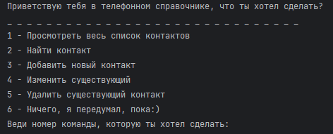
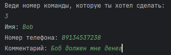

## Телефонный справочник (ДЗ 1 модуль)
### Данный телефонный справочник был выполнен в рамках первого ДЗ на курсе OTUS Python Basic. 

После запуска программы вас встретит меню выбора доступных команд.

Далее необходимо написать порядковый номер команды, которую вы хотите выполнить.

### 1. - Просмотреть весь список контактов

В случае выбора первого пункта меню, будет выведен список всех существующих контактов. 
Каждый контакт включает в себя имя, номер телефона и комментарий.

### 2. - Найти контакт

Для поиска необходимого контакта можно указать имя, номер телефона или ID контакта, если вы его знаете.

### 3. - Добавить новый контакт

При создании нового контакта необходимо по-очереди указать имя, номер телефона и комментарий.
Будьте внимательны, любое из полей может быть пустым, однако поле номера телефона не может содержать ничего кроме цифр.

### 4. - Изменить существующий

Выбор контакта для изменения производится путем указания ID. В случае, если какое-то поле нужно оставить прежним
ввод данного поля пропускаем. Изменение необходимо подтвердить нажатием клавиши 'y'. В противном случае изменения
не будут сохранены.

### 5. - Удалить существующий контакт

Удаление контакта так же производится по выбранному ID. Изменение необходимо подтвердить нажатием клавиши 'y', 
иначе контакт останется в книге.

### 6. - Ничего, я передумал, пока:)

Ну и если ничего выполнять не нужно, можно просто выйти.
